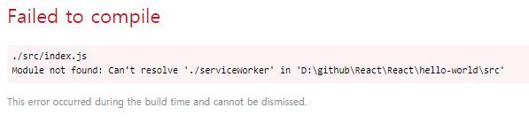
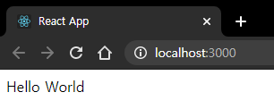

# React

 BTS_React Study/토이 프로젝트
 -----
## start(11.09)
2시에 디스코드에서 스터디 관련 일정 계획
> ### 스터디 계획
> * 매주 월요일 디스코드를 통한 실시간 스터디
>  * 각자 스터디한 내용 공유
> * git 활용
> * 1~3주차 React 기초 이론 및 실습
> * 4주차 : 토이 프로젝트 진행(개인)
>   * 추후 팀 프로젝트 진행(예정)

  

## 1day(11.10)
#### 리액트란?
자바스크립트는 웹 애플리케이션에서 가장 핵심적인 역할을 한다.
(ex. 디스코드, 펭스북, 페이팔, 이베이 등 개발)

이러한 애플리케이션을 순수하게 자바스크립트로만 관리하기에는 어려움이 있다.
이를 위해 수많은 프레임워크를 활용하였다.

프레임워크들은 주로 MVC 아키텍처, MVVM 아키텍처를 사용한다.

MVC, MVVM, MVW의 공통점 = 모델(Model) + 뷰(View)

모델 : 애플리케이션에서 사용하는 데이터를 관리하는 영역
뷰 : 사용자에게 보이는 부분

프로그램이 사용자로부터 입력을 받으면 컨트롤러는 모델 데이터를 조회하거나 수정한 뒤, 변경된 사항을 뷰에 반영한다. 반영하는 과정에서 뷰를 변형하게 되는데, 애플리케이션 규모가 커지면 수정하기 복잡해지고 관리에 따라 성능이 떨어질 수도 있다.

페이스북 개발팀에서 이를 해결하고자 개발한 것이 리액트이다.
리액트는 기존의 뷰를 제거하고 처음부터 새로 렌더링 하는 방식이다.
-> 애플리케이션 구조가 간단하고, 작성해야할 코드양이 줄어든다는 장점이 있다.

리액트는 자바스크립트 라이브러리로 사용자 인터페이스를 만드는데 사용한다.
MVC, MVVM, MVW의 공통점인 모델(Model)과 뷰(View)가 있는 것과는 달리 리액트에서는 뷰(View)만 사용하는 라이브러리이다.

  
## 2day(11.11)
#### 리액트 설치 및 실행
설치는 node.js와 yarn을 설치했다.
셋팅 후 hello-world를 입력하는데 잘 안된다.

피곤한 관계로 내일 이어서 하는걸로...일단 설치는 완료!

----------------------------------------------------
프로젝트 생성
터미널에 npx create-react-app 프로젝트명

프로젝트 실행
터미널>프로젝트경로 이동>npm start

프로그램
:Visual studio code 사용

  
## 3day(11.12)
#### 리액트 셋팅 완료
hello world 실행 완료!

 
####JSX란
자바스크립트의 확장 문법으로, XML과 매우 비슷하게 생겼다. 작성한 코드는 브라우저에서 실행 되기 전, 일반 자바 스크립트 형태의 코드로 변환된다.
##### JSX의 장점
* 보기 쉽고 익숙하다.
  * 자바스크립트로 요소들을 일일이 만들지 않기 때문에 가독성이 높고 작성하기 쉬움.
* 높은 활용도
  * HTML 태그 사용 외에 컴포넌트 또한 작성 가능.
#### 요소 감싸기
컴포넌트에 여러 요소가 있다면 반드시 부모 요소 하나로 감싸야 한다.
ex. 

감싸지 않으면 오류 발생(Failed to complie)

> ##### 왜?
>Vitrual DOM에서 컴포넌트 변화를 감지할 때 보다 효율적으로 비교할 수 있도록
><b>컴포넌트 내부는 하나의 DOM 트리 구조로 이루어져야 한다는 규칙이 있기 때문!</b>
